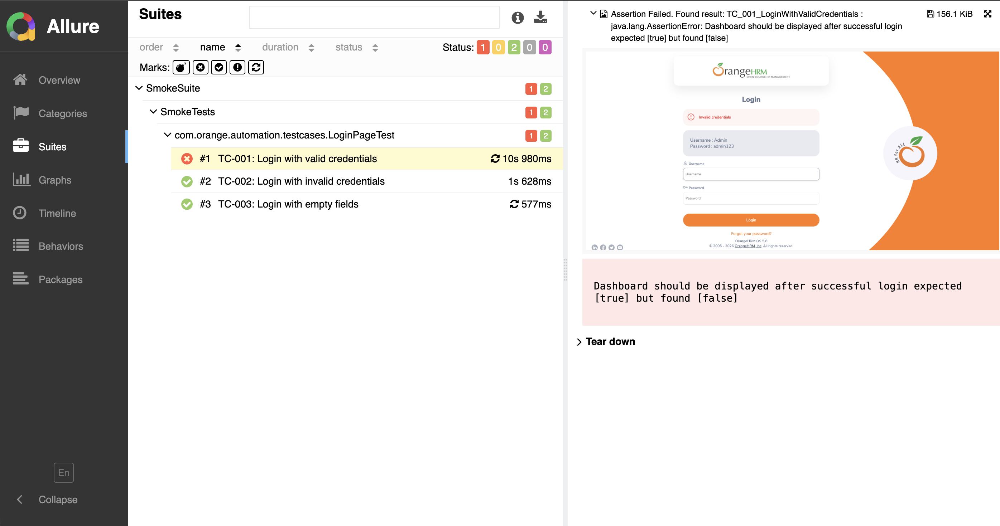
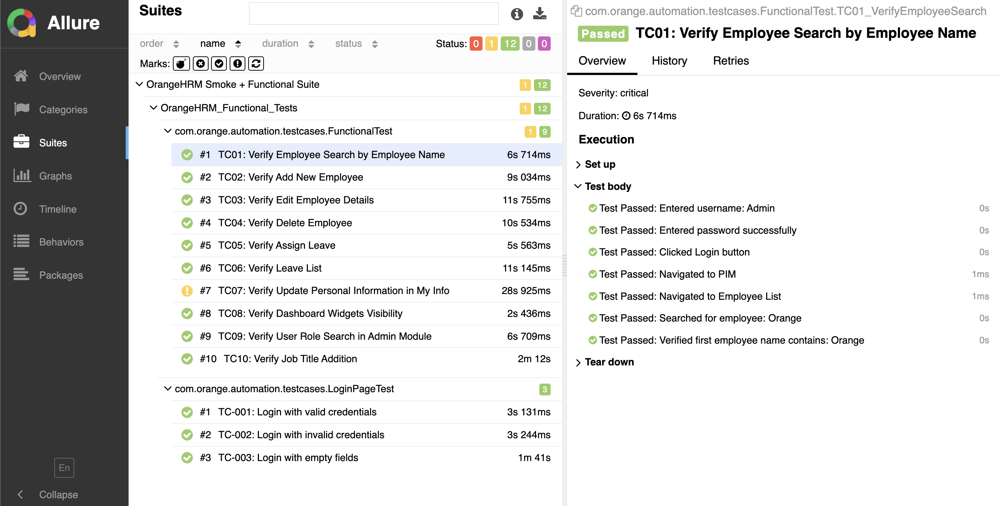

# 🍊 OrangeHRM UI Automation Framework


A robust, production-ready **Selenium + TestNG** automation framework for testing the [OrangeHRM](https://opensource-demo.orangehrmlive.com) web application. Built with clean architecture principles, including the **Page Object Model (POM)**, **ThreadLocal WebDriver** for parallel execution, **Allure reporting**, and **Log4j2 logging**.

---

## 📸 Screenshots of Test Execution Reports


*Allure Report — Test execution summary with pass/fail breakdown*


*Test suite run showing Smoke + Functional test results*

---

## 📋 Table of Contents

- [Tech Stack](#-tech-stack)
- [Project Structure](#-project-structure)
- [Framework Architecture](#-framework-architecture)
- [Prerequisites](#-prerequisites)
- [Setup & Installation](#-setup--installation)
- [Configuration](#-configuration)
- [Running Tests](#-running-tests)
- [Test Reporting](#-test-reporting)
- [Test Coverage](#-test-coverage)
- [Key Design Decisions](#-key-design-decisions)

---

## 🛠 Tech Stack

| Tool / Library         | Version   | Purpose                                      |
|------------------------|-----------|----------------------------------------------|
| Java                   | 21        | Programming language                         |
| Maven                  | 3.x       | Build tool & dependency management           |
| Selenium WebDriver     | 4.27.0    | Browser automation                           |
| TestNG                 | 7.10.2    | Test execution framework                     |
| WebDriverManager       | 5.9.2     | Automatic browser driver management          |
| Allure TestNG          | 2.27.0    | Test reporting                               |
| Log4j2                 | 2.24.3    | Logging                                      |

---

## 📁 Project Structure

```
OrangeHRMAutomation/
│
├── config/
│   └── config.properties          # Browser, URL, credentials, timeouts
│
├── src/
│   ├── main/java/com/orange/automation/
│   │   ├── base/
│   │   │   └── BasePage.java          # Parent for all Page classes; shared step logging
│   │   ├── pageobjects/
│   │   │   ├── LoginPage.java         # Page Object for the Login page
│   │   │   ├── DashboardPage.java     # Page Object for the Dashboard
│   │   │   ├── AdminPage.java         # Page Object for the Admin module
│   │   │   ├── PIMPage.java           # Page Object for the PIM (Employee) module
│   │   │   ├── LeavePage.java         # Page Object for the Leave module
│   │   │   └── MyInfoPage.java        # Page Object for the My Info module
│   │   └── utils/
│   │       ├── AllureReport.java      # Programmatic Allure report generation
│   │       ├── ConfigReader.java      # Reads config.properties (singleton utility)
│   │       ├── DriverManager.java     # ThreadLocal WebDriver initialization & teardown
│   │       ├── Listeners.java         # TestNG listener for pass/fail tracking
│   │       ├── PageManager.java       # PageFactory initializer for all page objects
│   │       └── ScreenshotUtil.java    # Captures & attaches screenshots to Allure
│   │
│   ├── main/resources/
│   │   └── log4j2.xml                 # Log4j2 configuration
│   │
│   └── test/java/com/orange/automation/
│       ├── base/
│       │   └── BaseTest.java          # Parent for all Test classes; setup & teardown
│       └── testcases/
│           ├── LoginPageTest.java     # Test cases for Login functionality
│           └── FunctionalTest.java    # Functional tests: PIM, Leave, Admin, My Info
│
├── test-suites/
│   └── smoketest.xml              # TestNG suite: Smoke + Functional tests combined
│
└── pom.xml                        # Maven dependencies & build config
```

---

## 🏗 Framework Architecture

```
BaseTest (@BeforeMethod / @AfterMethod)
    └── DriverManager (ThreadLocal WebDriver)
    └── ConfigReader (config.properties)

Test Classes (e.g., LoginPageTest, FunctionalTest)
    └── PageManager (PageFactory)
        └── Page Objects (LoginPage, AdminPage, PIMPage, LeavePage, MyInfoPage, DashboardPage)
            └── BasePage (stepPassed / stepFailed)
                └── ScreenshotUtil (auto screenshot on failure)
                └── Allure (step logging in report)

Listeners (TestNG ITestListener)
    └── Tracks pass/fail counts
    └── Triggers stepFailed on assertion errors

AllureReport (@AfterSuite)
    └── Auto-generates & opens Allure HTML report
```

---

## ✅ Prerequisites

Before running the project, make sure you have the following installed:

- **Java 21+** — [Download here](https://adoptium.net/)
- **Maven 3.6+** — [Download here](https://maven.apache.org/download.cgi)
- **Google Chrome** (default browser) — or Firefox / Edge
- **Allure CLI** (for report generation) — [Install guide](https://allurereport.org/docs/install/)

Verify your setup:
```bash
java -version
mvn -version
allure --version
```

---

## ⚙️ Setup & Installation

1. **Clone the repository:**
   ```bash
   git clone https://github.com/afeefahmedprof93-sy/selenium-ui-automation-framework.git
   cd selenium-ui-automation-framework/OrangeHRMAutomation
   ```

2. **Install dependencies:**
   ```bash
   mvn clean install -DskipTests
   ```

> **Note:** WebDriverManager automatically downloads the correct ChromeDriver — no manual driver setup needed.

---

## 🔧 Configuration

All test configuration is managed via `config/config.properties`:

```properties
# Browser Configuration (chrome | firefox | edge)
browser=chrome

# Application URL
url=https://opensource-demo.orangehrmlive.com/web/index.php/auth/login

# Test Credentials
username=Admin
password=admin123

# Timeouts (in seconds)
implicit.wait=10
explicit.wait=15
```

To switch browsers, simply change the `browser` property — no code changes required.

---

## ▶️ Running Tests

**Run the full smoke + functional test suite:**
```bash
mvn clean test
```

**Run a specific test class:**
```bash
mvn clean test -Dtest=LoginPageTest
mvn clean test -Dtest=FunctionalTest
```

**Run with a specific TestNG XML suite:**
```bash
mvn clean test -DsuiteXmlFile=test-suites/smoketest.xml
```

---

## 📊 Test Reporting

This framework uses **Allure** for rich HTML test reports. Reports are `auto-generated` after each suite run via `AllureReport.java`.

**To manually generate and open the report:**
```bash
# Generate report from raw results
allure generate allure-results -o allure-report --clean

# Open in browser
allure open allure-report
```

Each Allure report includes:
- ✅ Pass / ❌ Fail status per test
- Step-by-step execution log
- Screenshots automatically attached on failures
- Severity levels (`CRITICAL`, `NORMAL`, etc.)
- Epic → Feature → Story hierarchy

---

## 📌 Test Coverage

### 🔐 Authentication (`LoginPageTest`)

| Test ID | Test Case                          | Description                                              | Severity |
|---------|------------------------------------|----------------------------------------------------------|----------|
| TC_001  | Login with valid credentials       | Enter Admin/admin123 → verify redirect to dashboard      | CRITICAL |
| TC_002  | Login with invalid credentials     | Enter wrong username/password → verify error message     | CRITICAL |
| TC_003  | Login with empty fields            | Submit blank form → verify required field validation     | HIGH     |

### 👥 PIM Module (`FunctionalTest`)

| Test ID | Test Case                | Description                                                         | Severity |
|---------|--------------------------|---------------------------------------------------------------------|----------|
| TC01    | Employee Search          | Search by employee name and verify first result matches query       | CRITICAL |
| TC02    | Add New Employee         | Create a new employee with a unique timestamped name                | CRITICAL |
| TC03    | Edit Employee Details    | Search for an employee and update their middle name                 | NORMAL   |
| TC04    | Delete Employee          | Select and delete a previously added employee with confirmation     | CRITICAL |

### 🌴 Leave Module (`FunctionalTest`)

| Test ID | Test Case       | Description                                                              | Severity |
|---------|-----------------|--------------------------------------------------------------------------|----------|
| TC05    | Apply Leave     | Apply US - Vacation leave for an employee across a specified date range  | NORMAL   |
| TC06    | Leave List      | Filter and view leave records for the full year                          | NORMAL   |

### 👤 My Info Module (`FunctionalTest`)

| Test ID | Test Case               | Description                                             | Severity |
|---------|-------------------------|---------------------------------------------------------|----------|
| TC07    | Update Personal Info    | Update middle name and other ID fields in My Info       | CRITICAL |

### 🏠 Dashboard (`FunctionalTest`)

| Test ID | Test Case                   | Description                                              | Severity |
|---------|-----------------------------|----------------------------------------------------------|----------|
| TC08    | Dashboard Widgets Visibility | Verify Quick Launch, Employee Distribution chart visible | NORMAL   |

### ⚙️ Admin Module (`FunctionalTest`)

| Test ID | Test Case              | Description                                                       | Severity |
|---------|------------------------|-------------------------------------------------------------------|----------|
| TC09    | User Role Search       | Filter users by Admin role and validate all results match         | CRITICAL |
| TC10    | Add Job Title          | Navigate to Job Titles and create a new entry via automation      | CRITICAL |

---

## 💡 Key Design Decisions

**ThreadLocal WebDriver (`DriverManager`)**
Each test thread gets its own isolated `WebDriver` instance, enabling safe parallel test execution without driver conflicts.

**Page Object Model**
All UI interactions are encapsulated in dedicated page classes under `pageobjects/`. Tests never interact with Selenium directly — they call clean, readable page methods.

**`PageManager` with `PageFactory`**
All page objects are initialized via `PageFactory.initElements()`, keeping `@FindBy` annotations clean and managed in a single place.

**`ConfigReader` (Static Utility)**
Loaded once via a static block, `ConfigReader` provides type-safe access to all config values across the framework without repeated file I/O.

**`BasePage` — Centralized Step Logging**
`stepPassed()` and `stepFailed()` in `BasePage` handle Log4j2 logging, Allure step annotation, and screenshot capture in one place — every page action reports itself automatically.

**Auto-screenshot on Failure**
`ScreenshotUtil` uses Allure's `@Attachment` annotation to automatically embed a PNG screenshot into the report whenever a test step fails.

---

## 👤 Author & Collaborators

**Afeef Ahmed**

**Chowdhury MD Intiser Ali**
- GitHub: [@afeefahmedprof93-sy](https://github.com/afeefahmedprof93-sy)
